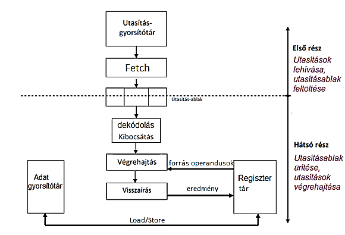

## 1. Számítási modell, architektúra

---

**fogalma:**  
számításra vonatkozó alapelvek absztrakciója

**kapcsolatai:**  
modell (követelmények), programnyelv (specifikáció), architektúra (implementáció)
fajtái: adat, objektum, predikátum, tudás, hibrid

**jellemzői:**  
min hajtjuk végre a számítást, hogyan képezzük le a feladatot, mi vezérli a sorrendet

**csoportosítás:**  
modell (szekvenciális/párhuzamos), vezérlés meghajtása (adat/vezérlés/igény), probléma leírása (procedurális/deklaratív)

**Neumann:**  
adatokon, változók, közös memóriaterület, adatmanipuláció, vezérlés meghajtott (PC)

**adatfolyam:**  
egyszeres értékadás, adathalmaz + adatfolyam gráf, szakosodott VE, adatmeghajtott, stréber, az adatokat az utasításokon belül tároljuk

**architektúra:**  
ismernie kell a programozónak, külső/belső felépítés, működés, MSI

**CPU szintű logikai arch. (ISA):**  
adattér, adatmanipulációs fa, állapottér, állapot műveletek

**CPU szintű fizikai arch.:**  
belső arch (műveletvégző, vezérlő, I/O rendszer, megszakítási rendszer)

## 2. Adattér

---

**fogalom:**  
adattárolás, közvetlenül manipulálható a CPU által, memóriatér + regisztertér

**címtér:**  
érvényes címek halmaza, modell (elméleti) + valós

**memóriatér:**  
címzés, címbusz, fizikai, virtuális

**fizikai:**  
CPU látja, gyors, kicsi
virtuális: programozó látja, transzparens folyamatok (adatok mozgatása, virt. címek valóssá fordítása)

**regisztertér:**  
nagy teljesítmény, saját címtér

**egyszerű regisztertér:**  
ac -> ac + data -> univerzális készlet -> stack 

**adattípusonként különböző:**  
FP (mantissza, karakterisztika), SIMD, sokkal gyorsabb

**többszörös:**  
egymásba ágyazott eljárások, kontextusváltás (kapcsoló, kommunikáció), több/átfedő/stack-cache regiszterkészlet

## 3. Adatmanipulációs fa

---

**fogalma:**  
potenciális adatmanipulációs lehetőségek, egy konkrét implementáció (részfa)

**szintjei:**  
adattípusok, műveletek, operandusok típusai (r/m/ac), címzési módok, gépi kódok

**adattípusok:**  
elemi (numerikus FX/FP/BCD, karakteres, logikai, pixel ...) / összetett

**FX:**  
egyes/kettes komplemens, előjel

**FP:**  
(nem) normalizált, binárisra normalizált (pontossági szintek)

**címzési módok:**  
címszámítás (abszolút, relatív), cím módosítás (auto inc/dec), deklarált cím interpretálása

**indexelés:**  
indexregiszterrel eltolás, több dimenzió

## 4. A szekvenciális utasításvégrehajtás menete

---

**aritmetikai utasítások:**  
...

**lehívás:**  
MAR <- PC  
MDR <- [MAR]  
IR <- MDR  
PC <- PC+1

**operandus betöltés:**  
DEC <- IR  
MAR <- DEC(címrész)  
MDR <- [MAR]  
AC <- MDR

**végrehajtás:**  
DEC <- IR  
MAR <- DEC(címrész)  
MDR <- [MAR]  
AC <- AC+MDR

**tárolás:**  
DEC <- IR  
MAR <- DEC(címrész)  
MDR <- AC  
[MAR] <- MDR

**feltétlen vezérlésátadás (JMP):**  
DEC <- IR  
MAR <- DEC(címrész)  
PC <- [MAR]

## 5. Az utasítás- és operandus típusok, állapottér, állapot műveletek

---

**utasítás típusok:**  
4 (d,s,s,kövi cím(PC)), 3, 2 (op1, op2), 1 (AC+op2), 0 (nop, push, pop...) címes

**operandus típusok:**  
AC (gyors, 1db), mem (nagy, lassú, hosszú cím), reg (gyors, kevés), stack (gyors, csak felső elem), immediate (érték)

**architektúrák osztályozása:**  
szabályos, kombinált (nem homogén, r+m)

**szabályos architektúrák:**  
csak 1 operandus típus (ar, am, mm(m), rr(r), ss(s))

**állapottér:**  
az adott programra vonatkozó állapot információkat tartalmazza

**látható állapottér:**  
PC, státusz indikátorok, címzési módok, indexelés...

**transzparens állapottér:**  
virt. mem kezelés, megszakítások, stack kezelés...

**állapot műveletek:**  
állapotjelzők manipulálása, PC (inc/dec, felülírás), flag (set/reset/save/load/clear)

## 6. Az aritmetikai egységek felépítése I.

---

**aritmetikai egység részei:**  
regiszterek, adatutak, kapcsolópontok, ALU

**adatutak:**  
nem busz, nincs címzés, látható/rejtett regiszterek <-> ALU, 1/2/3 utas

**kapcsolópontok:**  
regiszterek 2 végén tranzisztorok, nyit/zár (adatúton 1 adat), vezérlő

**ALU:**  
FX, FP, BCD, egyéb műveletek

**1 bites félösszeadó:**  
A+B -> S(xor), C(and)

**1 bites teljes összeadó:**  
A+B+Cin -> S,Cout, 2db félösszeadó + xor, S=AXBXC C=ACin+BCin+AB

**n-bites soros összeadó:**  
carry (flip/flop reg), 2 léptető reg, 1bites késleltető

## 7. Az aritmetikai egységek felépítése II.

---

**n-bites párhuzamos összeadó:**  
Ripple Carry Adder (több öszeadó egymás mellett)

**előrejelzett átviteles összeadó:**  
carryk csak bemenetektől függenek, rekurzív, generate(AB), propogate (A+B), CLA

## 8. Az aritmetikai egységek felépítése III.

---

**FX szorzás:**  
összeadás, invertlálás, léptetés (gyűjtő kinullázva)

**FX szorzás gyorsítás:**  
bitcsoport (00,01,10,11), Booth-féle (sok 1-es lassú -> közelebbi számmal szorzás léptetéssel, majd +/-)

**BCD ábrázolás:**  
pontos megfeleltetés, nincs kerekítés, 4bit (0-9, érvénytelen tetrádok), zónázott (1byte, zóna+szám), pakolt (1byte, 2szám), hossz

**BCD összeadó:**  
összeadás, érvénytelen tetrád detektálás, konverzió

## 9. Az aritmetikai egységek felépítése IV.

---

**lebegőpontos számok:**  
normalizált formátum (0.1 ... * 2^k, 1/r <= M < 1)

**jellemzőik:**  
ért.tart. (rendelkezésre álló bitek, radix), pontosság (M bitek), alulcsordulás/túlcsordulás

**formátumok:**  
szabványos (háttértár), kiterjesztett (CPU), 1x 2x pontosság

**tárolás:**  
1-23-8, 1-52-11

**kódolás:**  
M(2es komplemens), k(többletes)

**kerekítések:**  
legközelebbire, 0ra kerekítés (örzőbitek levágása), +/- végtelenre

**kivételek kezelése:**  
megszakítás, alul/túlcsordulás, 0val osztás, gyökvonás negatívval

**kivételek kezelése:**  
túlcsordulás (jelzés, max beállítása/előjeles végtelen), alulcsordulás (0ra konvertálás, denormalizálás)

**algebrai műveletek:**  
aritm, maradék, gyökvonás, bin-dec konverzió, végtelennel művelet

**logikai megvalósítás:**  
...

**fizikai megvalósítás:**  
dedikált FP műveletvégző (adatbusz, M,k egységek, vezérlő)

**IEEE 754:**  
kompatibilitás, rendszerszintű(HW+SW), adattípus, formátum (szabványos, kiterjesztett), műveletek, kerekítések

**ALU egyéb műveletei:**  
bool(16), léptetés, invertálás, komparálás, feltételes ugrás, load/store, karakteres műveletek

## 10. Vezérlőegység

---

**BEV:**  
egyik legbonyolultabb, titkos, szekvenciális/párhuzamos, több 1000 (decentralizált), ütemező

**áramköri vezérlőegység:**  
tervezés (igazságtábla, célfüggvények, egyszerűsítés, megvalósítás), forrásregiszter -> módosító áramkör -> célregiszter, gyors, bonyoult, merev

**mikrovezérlő:**  
minden CPU utasítás mikroutasításokkal valósul meg, vezérlő vonal készlet, kimenet=vezérlő jel, programozott vezérlőegység (pl floppy), HW ismeret, lassú, egyszerűen módosítható

**áramköri vezérlőegység megvalósítása:**  
optár, MDR, MAR, IR, DEC, ütemező, CLOCK, PC, ütemező, külső feltételek

**működése:**  
kapuk nyitása, másolás, módosítás előírása, kapuk nyitása, eredmény másolása

## 11. Félvezetős tárak

---

**jellemzőik:**  
gyorsabb mint a háttértár, kondenzátor+tranzisztor, kisül (frissíteni kell)

**csoportosításuk:**  
írható (DRAM optár, SRAM gyorsítótár), főképpen olvasható (CMOS/flash), olvasható (ROM)

**DRAM típusok:**  
klasszikus (aszinkron), SDRAM (szinkron, gyorsabb, SDR single/DDR double)

**működésük:**  
rendszersínnel van szinkronizálva (válasz órajelre fel/le), több logikai egység (bank, párhuzamos memóriahozzáférés), futószalagos elcsúsztatás (gyorsabb mint aszinkron), futószalag olvasás (latency)

**időzítések (5):**  

- tCL (CAS latency, olvasási parancs -> megjelenés)
- tRCD (RAS to CAS delay, bank megnyitás -> oszlop kiválasztás),
- tRAS (banksor aktiválás -> lezárás),
. tRP (row %, banksor lezárás -> új banksor megnyitása),
- tRC (ciklusidő, bank sorainak olvasásai közti idő) 

**olvasási ciklus:**  
bank megnyitás, oszlopblokkok olvasása, bank zárása, min tRP várakozás

**DIMM-ek jellemzői:**  
64bit, 168-284 pin, registered DIMM modulok (DRAM és memóriasín közt puffer regiszter), ECC bit (paritásbit++, hibák felismerése/javítása), PLL (órajel elcsúszás mentesítés)

## 12. Külső buszrendszer

---

**fogalma:**  
egységek közti kommunikáció (CPU-MEM-periféria)

**fejlődése:**  
ez volt a legjobb komm, sávszélesség folyamatos bővítése (8-16-32-64bit)

**jellemzői**  
kizárólag ezen keresztül kommunikálnak, egy rendszerre több egység kapcsolódik, irány, összehangolás, szabványosítás, transzparens

**csoportosítása**  
átvitel iránya (simplex, félduplex, duplex), átvitt tartalom (adat, cím, vezérlő), átvitel jellege (dedikált, shared), összekapcsolt területek, átvitel módja (soros/párhuzamos)

**vezérlővonalak**  
adatátvitel (M/IO, R/W, WD/B adatméret, DS data strobe, A/S, RDY), megszakítás (kérés, visszaigazolás), buszvezérlés (buszfoglalás, visszaigazolás), egyéb (RST, CLK)

**párhuzamos buszok (+/-)**  
nagy csatlakozási felület(sok hely), nem lehet nagy frekv. átvitel (Delay Skew időbeli eltérés), EMI elektromágneses interferencia (zaj), vezetékek közti áthallás

**soros buszok (+/-)**  
csak egymás után lehet biteket küldeni (kódolás->plusz HW)

**PCI**  
a perifériák mintha a rendszerbuszon lennének, CPU közvetlenül címzi, párhuzamos, megosztott, minden eszköz közös cím/adat/vezérlő vezetékkel, arbitrálás (buszfoglalás), 1db busz

**PCIe**  
soros, gyors, kevés érintkező, hot-plug, különálló vezetékek, full duplex, többféle szélességű aljzat

**FSB**  
CPU<->perifériák, 64bit, CPU-n kívüli komm., northbridge (gyors, memóriák, grafikus interfész), southbridge (IO kontroller, lassab perifériák kiszolgálása)

**HyperTransport**  
amd, kétirányú, széles sáv, alacsony késleltetés, csomagkapcsolt, FSB kiváltása, alagút (hozzáláncolható további HT), barlang (utolsó egység a láncban)

**QPI**  
intel, distributed shared memory (logikailag közös), csomagkapcsolt, 5 réteg, pont-pont (dedikált átvitel)

## 13. A processzor részvételével zajló I/O rendszer

---

CPU <-> IO <-> (külső illesztők) periféria, korábban vezérlőkártya

**fejlődése:**  
1. CPU <-> periféria (megszakítás nélküli prog. IO)
2. IO modul (vezérlő, wait for flag -> megszakítás vezérlő)
2. DMA (közvetlen hozzáférés, gyors perifériákhoz)
3. IO csatorna (lassabb perifériákhoz, IO utasításkészlet)
4. IO processzor (saját memória, önálló működés)

**programozott I/O:**  
CPU aktív részvétel (lekérdezéses) / CPU megszakítással, CPU által irányított, egyszerű, CPU igényes

**különálló I/O címtér:**  
CPU 2 címteret lát (IO / optár), közös busz (lehetnek azonos címek -> M/IO, külön IO utasítások), egyszerű, olcsó, CPU igényes

**I/O port:**  
vezérlő kártyán, rendszerbusz és periféria közti csatl. pont, egyedi azonosító (saját cím), min. 1 adatregiszter, parancsregiszter, adatregiszterek (input/output), állapotregiszter, jelenlét ellenőrző reg, tulajdonságokat tartalmazó reg, 

**memóriában leképezett I/O címtér:**  
nem kell plusz utasítás, IO vezérlő hozzáfér a rendszerbuszhoz, gyorsabb átvitel, pl monitor, közvetlen címzés

**feltétlen működés:**  
periféria mindig adatátvitelre alkalmas állapotban kell legyen, nincs szükség ellenőrzésre, nincs szinkronizáció, nincs visszacsatolás, pl monitor

**feltételes működés:**  
feltételhez kötött adatátvitel, pl nyomtató, lekérdezéses (cpu várakozik, állapotreget figyeli) / megszakításos (megszakításkérés -> állapotreg -> adatátvitel)

**I/O csatorna:**  
DMA kiterjesztése a lassú perifériákra, CPU nem dolgozik, nincs saját memória,  IO utasítások a memóriában (nincs felprogramozás), program specifikálja az adatátvitelt

**IO csatorna selector:**  
IO csatorna vezérlő <-> (1 vonal) IO vezérlők  
egyszerre 1 kommunikálhat az I/O csatorna vezérlővel (gyorsabb perifériák)

**IO csatorna multiplexer:**  
IO csatorna vezérlő <-> (több vonal) IO vezérlők  
több IO vezérlő csatlakozik párhuzamosan (lassab perifériák), küldés byte-onként / blokkonként (cél: átvitel maximalizálás)

## 14. A közvetlen memória-hozzáférés (DMA)

---

**fogalma:**  
Direct Memory Address  
sok adat esetén, gyors perifériáknál (pl merevlemez), CPU nélküli adatátvitel, szerény komplexitásnövekedés

**megvalósítása:**  
memória, címbusz, adatbusz, CPU, DMA vezérlő (DC számláló, AR, DR, vezérlő, regiszterek)  
címgenerálás (közvetlen tárhozzáférés), buszvezérlés (igénylés, kiválasztás)

**működése:**
1. felparaméterezés (MAR -> MDR -> DMA regiszterek), prog. IO-val történik, R/W, IO egység címe, mem cím kezdőértéke (IOAR), adat jellege (bitek száma), olvasandó/írandó egységek száma (DC), átvitel módja (blokkos/cikluslopásos), DMA csatornák priorizálása, résztvevő egységek
2. busz lefoglalása (blokkos üzemmód esetén), DMA betölti a paramétereket a regekbe
3. DMA request (megszakítás kérés küldése)
4. DMA acknowledge (nyugtázás)
5. IO -> MEM (IOAR, IODR)
6. --DC == 0 ? megszakítás kérés : IOAR++
7. CPU ellenőrzi az adatátvitelt, átveszi a vezérlést

**blokkos üzemmód:**  
sok adat esetén, kevesebb megszakítás

**cikluslopásos üzemmód:**  
kevesebb adat esetén, csak 1-1 adatátvitelre kapja meg a buszt a DMA vezérlő, decode+execute: DMA töréspont (nem kell busz), szubrutinszerű működés, párhuzamos működés miatt már nem használatos

## 15. Megszakítási rendszer

---

**fogalma:**  
váratlan események kezelése, cél: reagálás, folyamatosan változó körülmények közt optimális működés

**megszakítási okok:**  
1. géphibák (pl autom. hibafigy. áramkörök jelzései: hőmérséklet, ventillátor, hibajelző kódok, watchdog, paritásell.)
2. IO források
3. külső források (reset, hálózati komm.)
4. programozási források: szándékos / hibakezelés

**megszakítási források:**  
- szándékos (rendszerhívás)  
- hibakezelés: utasítások végrehajtása során, pl memóriavédelem megsértése, tényleges tárkapacitás túlcímzése, címzési előírások megsértése, aritmetikai/logikai

**megszakítás folyamata 1:**  
ha elfogadható -> analízis -> állapot mentés -> kiszolgálás (megszakítási kontextus betöltése) -> állapot visszatöltése -> köv. utasítás

**megszakítás folyamata 2:**  
előkészítés (megszakítás kérés: INTR vezérvonal) -> elfogadható-e, megszakítás bemenet (egyszintű) / megszakítás áramkör (többszintű) -> érvényre jutás (megszakítható folyamat + megfelelő prioritás + nincs maszkolva) -> INTACK aktiválás + INTR deaktiválás

**csoportosítás:**
1. szinkron (mindig ugyanott jelentkezik, jósolható, pl DMA)  
aszinkron (véletlenül jelentkezik, pl HW hibák)
2. utasítások végrehajtása között (eredmény, kezelés azonnal kezdődhet)  
közben (nincs szinkronban a végrehajtási ciklussal, pl HW megszakítás)
3. user által kért / nem kért
4. megszakítás után folytatódik / befejeződik
5. maszkolható (letiltható, pl billentyúzet) / nem maszkolható (pl HW hibák)

**egyszintű:**  
ha létrejön, addíg nem kezdődhet másik megszakítás, amíg nem végzett (nem megszakítható megszakítás), priorítások alapján

**többszintű:**  
fontossági sorrend, alacsonyabb megszakítás megszakítható egy magasabb megjelenése esetén, megszakítási forrásokat/okokat osztályozzák (prioritásokat rendelnek hozzájuk), osztályokon belül egyszintű (nem szakítják meg egymást)

## 16. Számítógép architektúrák osztályozása

---

**Flynn-féle osztályozás:**  
rendszere a vezérlő és a feldolgozási egységek számán alapul

fogalmak:
1. SI (single instruction stream): egyszeres utasításfolyam, 1 VE, szekvenciális végrehajtás
2. MI (multiple instruction stream): több VE, párhuzamos végrehajtás
3. SD (single data stream): egyetlen CPU egyetlen adatfolyam
4. MD (multiple data stream): több VE, több adatfolyam

osztályok:  
1. SISD (Neumann)
2. SIMD (multimédia feldolgozás)
3. MISD (elméleti, nem nagyon használják)
4. MIMD (teljes párhuzamos feldolgozás)

nem utal a párhuzamosság fajtájára, szintjére, módjára

**korszerű osztályozás:**  
adatpárhuzamos architektúrák:
- vektor
- asszociatív / neurális
- SIMD
- szisztorikus

funkctionálisan párhuzamos architektúrák
- utasítás szinten (ILP - instruction level parallelism)
  - futószalag (időbeli párhuzamosság)
  - VLIW (térbeli + időbeli)
  - szuperskalár (térbeli + időbeli)
- szál szinten (SMT - simultan multithreading)
- folyamat szinten
  - elosztott memória használatú
  - közös memória használatú

## 17. A párhuzamos feldolgozás követelményei; adatfüggőségek

---

1. Az utasítások párhuzamos végrehajtása során minden ILP CPU-nak figyelembe kell vennie az utasítások között fennálló függőségeket.
2. Meg kell őrizni a soros végrehajtás konzisztenciáját.

**fogalma:**  
az egymást követő utasítások ugyanazt az adatot, vagy a másik eredményt akarják használni

**főbb fajtái:**  
- jellege szerint
  - utasítás szekvenciában (lineáris feldolgozás)
    - valós (RAW - read after write)
      - műveleti
      - behívási
    - álfüggőség
      - WAR
      - WAW
  - ciklusban
- operandus típusa szerint
  - regiszter
  - memória

műveleti adatfüggőség (valós):  
3 operandusos utasítások, 4 fokozatú futószalag (F, D, E, W/B)  
MUL r3 r2 r1  
SHL r3 (nincs meg r3 eredménye futószalagnál -> NOP használata)

fékező hatás csökkentése:
- statikusan: compiler (szoftveres)
- dinamikusan: operandus előrehozása extra hardverrel (RSLT -> SRC az ALU-nál - így már W/B előtt megvan r3)

lehívási / betöltési adatfüggőség (valós):  
az adatot a művelet előtt a cache-ből a regiszterbe kell mozgatni (lassú) -> ezzel egy időben SRC-be is betöltjük

WAR (write after read, álfüggőség):  
MUL r3 r2 r1  
ADD r2 r4 r5 (ha előbb fut le, akkor a MUL hibás eredményt ad)  
megoldás: r2 tartalmához átmeneti (transzparens) regiszter használata

WAW (write after write, álfüggőség):  
MUL r3 r2 r1  
ADD r3 r4 r5 (előbb kerül az összeadás eredménye r3-ba)  
megoldás: átnevezési regiszter (statikus / dinamikus)

ciklusbeli függőség (erős függőség):  
előző ciklus eredménye kell  
kezelés: algoritmus áttervezése

**teljesítmény-korlátozó hatása:**  
...

## 18. Vezérlésfüggőségek és teljesítmény korlátozó hatásuk csökkentése

---

**vezérlésfüggőségek fogalma:**  
elágazás esetén PC-t felülírjuk az Execute-ban, viszont a következő Fetch-ek még nem tudják

**teljesítmény korlátozó hatása:**  
veszélyeztetjük az architekturális regiszter tartalmakat

**csökkentése:**  
- utasítások átrendezése a compiler-rel (előrehozza a JMP-t), hatása a fokozatok növelésével csökken
- ugrási buborék: JMP után NOP utasítások (n-1 darab)

**feltétlen vezérlésátadás:**  
JMP esetén PC-t felülírjuk execute-ban, viszont a következő fetch-ek még nem tudják

**statikus elágazásbecslés:**  
fetch fokozat végzi:
- fix (mindíg ugrik)
- programkód tulajdonságai alapján ugrik

**dinamikus elágazásbecslés:**  
...

**spekulatív elágazáskezelés elve:**  
feltételes elágazás (dinamikus kezelés végrehajtás során)  
irány becslése -> utasítások lehívása -> hibás becslés esetén törlés, helyes irány lehívása

## 19. Szekvenciális konzisztencia

---

párhuzamos végrehajtás, szekvenciális logika, meg kell maradjon a logikai integritás

**utasítás-feldolgozás soros konzisztenciája:**  
- utasítás végrehajtás (processzor konzisztencia)
- memóriahozzáférés

processzor konz:  
DIV r3 r2 r1  
ADD r5 r6 r7 (gyorsabb)  
JZ címke (r5 alapján kéne ugorjon, és nem r3)

**kivételkezelés soros konzisztenciája:**  
- pontatlan (gyenge)
- pontos (erős)

MUL r3 r2 r1  
ADD r6 r5 r4  
JZ címke

ha ADD túlcsordul és MUL nem végzett -> megszakítás -> kontextus mentése (r3 eredménye lehet, hogy nem megfelelő még)

**precíz megszakítás-kezelés:**  
INTR kéréseket csak az utasítások eredeti sorrendjében fogadja el (minden korábbi utasítás / megszakítás be kell fejeződjön)

megvalósítás:
- átrendező puffer (ROB)
- címkezelés (utasítások sorszámozása)

## 20. A futószalag (pipeline) elvű utasítás-végrehajtás

---

**futószalag elve:**  
utasítások fokozatokra bontása  
[F D E W/B] átfedésben, elméletben 4x sebességnövekedés, gátjai a függőségek (fokozatok számával nő)

**jellemzői:**  
15-30 fokozat az optimális általános célú alkalmazásoknál  
előfeltételei 2 fokozat esetén:
- 2 független VE
- egyik fokozat kimenete a másik bemenete (időbeli párhuzamosság)
- mindkét fokozat végrehajtási ideje azonos
- szinkronizált fokozatok (órajelre működnek)

típusok:  
- előlehívás (overlapping): csak W/B és F, 25% gyorsulás, nincs függőség
- vektor CPU: csak az Execute futószalagos
- teljes pipeline

**logikai felépítés:**  
cél: funkcionális kialakítás (pl aritmetikai, ugró, load/store) -> dedikált futószalagok -> kevesebb tranzisztor, gyorsabb mint az univerzális

**fizikai megvalósítás:**  
cél: logikai futószalagok megvalósítása  
- elválasztó puffer regiszterek -> VE -> puffer (várakozások)
- térbeli párhuzamosság (több VE fokozatonként)
- konzisztencia fokozat: több párhuzamos Execute fokozat esetén
- interlock: fokozatok közti várakoztatás

## 21. Az utasítások időben párhuzamos feldolgozásának alapvető lehetőségei

---

**prefetching:**  
W/B közben mehet F -> 25% gyorsulás

**átlapolt utasítás végrehajtás:**  
futószalag: elméleti 4x gyorsulás

**újrafeldolgozás:**  
Execute esetén pl szorzásnál felesleges a részeredmények regiszterbe írása, egyből visszavezethetjük az eredményt a bemenetre.

**futószalag elvű feldolgozás következményei:**  
- utasítás lehívás / operandusok betöltésének felgyorsulása
- sebesség olló: operatív tár sebessége nem nő a CPU-val arányosan -> cache bevezetése
- maximális végrehajtási sebesség: 1 / ciklus
- további növekedés: kibocsátási párhuzamosság, utasításon belüli párhuzamosság (multimédia)
- vezérlés átadási utasítások kifinomult feldolgozási technikája

cache előnye: gyakran használt operandusok gyors elérése

**szűk keresztmetszetek kezelése:**  
- memória: cache
- feltétlen elágazás: ugrási buborék (n-1)
- feltételes elágazás: minimum +2 óraciklus (feltétel kiértékelése, ugrási címszámítás)
  - korai RISC: ugrási buborék
  - korai CISC: dekódoló fokozatba építették a logikai komparáló és címszámító egységet
  - későbbi CISC: fix előrejelzés (pl mindíg ugrik)

## 22. Szuperskalár architektúrák

---

**működési elvük:**  
- óraciklusonként több utasítás kibocsájtása (kibocsátási ráta)
- időbeli + térbeli párhuzamosság (több futószalag egymás mellett)
- függőségkezelés dinamikusan (extra HW)
- kompatibilitás: evolúció

**Harvard architektúra:**  
az adat és a programkód külön útvonalakon mozognak -> párhuzamos adatutak -> növekvő teljesítmény

módosított Harvard architektúra:  
képes programot adatként betölteni

vezérlési vázlat:  
data cache, instruction cache, vezérlő, ALU

előnyök:
- képes párhuzamosan adatot és utasítást olvasni / írni cache nélkül is
- data és instr. cache különálló címtartomány, különböző hosszú címekkel

**CISC-RISC architektúrák:**  
kezdetben RISC volt 70-es évekig  
bővült az utasításkészlet -> CISC  
80-as évek vége: túl bonyolult utasítások, címzési módok egyszerűsítése -> inkább RISC (ARM)

RISC (Reduced Instruction Set Computing):
- kis számú utasításkészlet (50-150)
- nincs olyan utasítás, amely a LOAD/STORE-t aritmetikával kombinálja
- minden műveletvégő utasítás csak regisztereket használ
- memória / cache elérés csak LOAD/STORE utasításokkal
- nagy számú regiszterkészlet
- általában 3 operandusos utasítások
- minden utasítás ugyanolyan hosszú (pl 128 bit)
- bonyolul fordítóprogram
- általában huzalozott (HW) utasítás dekódolás
- utasítás végrehajtás 1 óraciklus alatt (cél: egyforma ciklusidő)
- gyors (+)
- bonyolultabb feladatokat instrukció szekvenciákkal kell megoldani -> hosszú program (-)

CISC (Complex Instruction Set Computing):
- nagyszámú utasításkészlet (több száz)
- nagy belső mikroprogramtár (utasítások tárolása)
- sokféle címzési mód
- változó utasításhossz -> dekódoló azonosítja az utasítás hosszát
- közvetlen memóriaelérés
- 2 operandusos utasítások
- második operandus lehet memória is
- utasítások feldolgozása több ciklusidő
- egyszerű gépi kódú programozás
- egy utasításban több elemi művelet is lehet
- kompatibilitás régebbi programokkal
- az idő 80%-ában az utasítások 20%-át használja -> CISC-en belüli RISC magok -> gyorsított feldolgozás
- futószalag fokozatok közt időbeli eltérés -> interlock
- RISC-hez képest +2 fokozat: AG (címszámítás), cache elérés

**lokális elágazás előrejelzés fogalma:**  
az elágazások történetét történetbitek segítségével írja le

**lokális egyszintű dinamikus elágazás előrejelzés:**  
- 1: elágazás
- 0: soros

**kétszintű dinamikus elágazás előrejelzés:**  
- 11: határozott elágazás (kezdeti állapot)
- 10: gyenge elágazás
- 01: gyenge soros
- 00: határozott soros

**feltételes elágazás előrejelzés egyéb lehetőségei:**  
...

## 23. Első generációs (keskeny) szuperskalár processzorok

---

**jellemzőik:**  
- RISC: ~3 utasítás kibocsájtása / ciklus
- CISC: ~2 utasítás kibocsájtása / ciklus
- közvetlen (nem pufferelt) kibocsátás
- statikus elágazásbecslés: fetch fokozat végzi
  - fix (mindíg ugrik)
  - programkód tulajdonságai alapján
- cache: 2 szintű (L1 lapkán + L2 különálló)
- operatív tár közös, L2 közös, L1 osztott (Harvard)

**közvetlen kibocsátás:**  
a CPU a dekódolt utasítást közvetlenül küldi a VE-hez

utasítás ablak (puffer):  
- óraciklusonként kibocsátandó utasításokat tartalmazza
- dekódolás + függőség ellenőrzés
- a végrehajtható (nincs függőség) utasítások kibocsátásra kerülnek
- utasítás ablak töltése egyesével / egyszerre
- kibocsátás, végrehajtás: sorrendben / sorrenden kívül

kezdetben: egyszerre pótlás + sorrendi kibocsátás, ~1 utasítás / ciklus

**végrehajtási modelljük:**

szűk keresztmetszet:
- memória: óraciklusonként több hozzáférés -> cache  
- elágazás feldolgozás -> statikus becslés

**kibocsátási szűk keresztmetszet:**  
- sorrendi kibocsátás esetén, ha az utasítás függő, akkor blokkol  
- minden adatfüggőség blokkol  
- max 1-2 utasítás / ciklus általános célú felhasználás esetén

## 24. Első generációs (keskeny) szuperskalár processzorokra esettanulmány

---

**Pentium I.: megvalósítás és jellemzők:**  
- CISC
- 1 dedikált futószalag (V): FX, LOAD/STORE, branch, 1 ciklusos utasítások
- 1 univerzális (U/master): x86, +3 fokozat (FP műveletekhez)
- a futószalagok akkor dolgoznak egyszerre, ha egyszerű utasításokat tudnak feldolgozni
- 5 fokozat: F, D, AG (address generation), E, W/B
- belül 64 bit, kívül 32 bites csatlakozások
- ugrás előrejelzés: 2db prefetch buffer
- 8-8 KB adat és utasítás cache

utasítás cache, branch prediction, (F+prefetch, decode, issue), V/U + FP futószalag, FX regiszter, FP regiszter, data cache, buszvezérlő

## 25. Második generációs (széles) szuperskalár processzorok

---

**dimnamikus utasítás-ütemezés:**  
- várakoztatás / pufferelt utasítás kibocsátás
- megnöveli a mikroarchitektúra elejének átbocsájtóképességét

lényege:
- pufferelt utasítás kibocsátás (sorrendi)
- sorrenden kívüli kiküldés (VE-k felé)
- nominális ráta (nem fogja vissza semmi): 3-4 utasítás / ciklus
- állapot bitek: függő / független

**regiszter-átnevezés:**  
függő utasítások számának csökkentése az ál adatfüggőségek megszüntetésével (WAR+WAW)

- minden célregiszterhez átnevezési regiszter allokálása
- átnevezési logika követi az allokációkat -> átnevezik a forrásregisztereket is (csak az átnevezési reg készletet kell figyelni)
- allokáció: utasításokhoz kapcsolódik
- függőség megszűnik -> E -> W/B -> átnevezési regiszterek felszabadítása

**végrehajtási modelljük:**

CISC:
- utasítások RISC-szerűvé konvertálása (dekódolási fázis)
- visszaalakítás (visszaírás fázis)

**ROB működése:**  
- körben utasítások
- bemeneti mutató (utolsó utasítás)
- kimeneti mutató (első utasítás)
- első utasítás független -> kiküldés -> mutatók léptetése

kiírási szabályok:  
- csak akkor írható ki az architekturális regiszterbe az eredmény, ha az összes korábbi utasítás is végrehajtódott -> az utasítások kiírása csak sorrendben történhet
- állapot bit (spekulatív bit): spekulatív állapotban lévő utasítás nem írható ki
- rekonverzió (RISC->CISC): a CISC utasításhoz tartozó RISC utasítások csak egyszerre írhatók ki

**értékelésük:**  
- kibocsátási ráta: 3 CISC, 4 RISC
- kiküldési ráta: 5-8
- tölcsérszerű elv
- stréber: operandus rendelkezésre áll -> kiküldés (adatvezérelt)

## 26. Kibocsátáshoz és a kiküldéshez kötött operandus-lehívás

---

**megvalósítása:**  
MK OP1 A2 OP2 A3 OP3

állapot bit:
- 0: nem áll készen
- 1: készen áll

kibocsátáshoz kötött:
- OP készen áll: átnevezési regiszterből tölti be az értéket
- OP nem áll készen: regiszterazonosítót tölt be az operandus helyére -> várakoztató állomás -> kibocsátáskor OP betöltése

kiküldéshez kötött:
- kibocsátáskor minden állapot bit 0 -> forrásoperandus = regiszter azonosító
- egyszerűbb, gyorsabb

**kibocsátáshoz és kiküldéshez kapcsolódó feladatok:**  
- állapotbitek állítása
- operandusok rendelkezésére állásának vizsgálata

**frissítés:**  
- állapotbitek állítása?
- operandusok rendelkezésére állásának vizsgálata?

**értékelés:**  
...

## 27. Második generációs (széles) szuperskalár processzorokra esettanulmány

---

**Pentium Pro: megvalósítás és jellemzők:**  
- kezdeti frekvencia: 133 MHz
- FX futószalag: 14 fokozat
- 20 bejegyzéses várakoztató állomás (vegyes)
- ROB
  - szigorúan soros konzisztencia
  - regiszter átnevezés
- lehívás
- dekódolás
  - D1: legfeljebb 4 RISC műveletté átalakítható CISC utasítások dekódolása
  - D2: 1-1 (egyszerű)
  - D3: 1-1 (egyszerű)
  - MIS: 4-nél több átalakítás
- regiszter képző tábla

CISC architektúra megtartása: kompatibilitás

## 28. Harmadik generációs szuperskalár processzorok: az utasításon belüli párhuzamos végrehajtás

---

szuperskalár multimédiás / 3D kiegészítése

**három-operandusú utasítások:**  
...

**SIMD-utasítások:**  
egyetlen utasításon belül több operanduson ugyanaz a művelet (pl Intel MMX)

4 fixpontos összeadás: [x1 x2 x3 x4] + [y1 y2 y3 y4]

jellemzői:
- kibővített utasításkészlet
- logikai architektúra kiterjesztése
- több operandus -> memória sávszélesség igény -> L2 CPU lapkára kerül
- buszrendszer bővítése (pl. AGP, PCIe)
- multimédiás használati eseteknél gyorsulás: nincsenek függőségek

FX SIMD utasítások:
- hang, pixeles multimédia alkalmazások gyorsítása
- 2-8 operandus / utasítás

FP SIMD:
- vektoros és 3D feldolgozás gyorsítása
- 2-4 operandus / utasítás

hangeldolgozás:
- digitalizálás: mintavételezés (Hz)
- tárolás: bitek száma
- tömörítés: pl AVI / MP3 -> valós idejű visszajátszás

képfeldolgozás:
- képpont: szín (RGB), fényesség
- színfordítási táblázat -> színskála kódolása
- tárolás: bitek száma (8-16-24-32)

probléma: nagy mennyiségű adat feldolgozása / tárolása

megoldás:
- multimédia kártya (célhardver)
- CPU multimédiás bővítése

bit-blokk átvitel: minden ablakot egy bit-blokként kezelünk (pl. 1920x1080 24 bites pixel -> 6MB)

- új adattípus: pakolt byte (FX, 8x8=64 bit)
- új műveletek: 4 alap + logikai műveletek

fizikai architektúra:
- 64 bites regiszterek
- 64 bites buszrendszer

**vektoros multimédia feldolgozás:**  
- egyenesekkel / görbékkel határolt objektumok geometriai jellemzőkkel leírhatók
- a képeket sokzögekre bontjuk fel -> könnyen mozgatható, méretezhető
- textúrák: geometriai élek elmosása

3D ábrázolás:
- harmadik dimenzió értelmezése
- a párhuzamosak a végtelenben összetartanak
- a közelebbi objektumok nagyobbak, élesebbek
- atmoszférikus hatás: távolabbi objektumok halványabbak, kékesebbek

3D filmek:
- min 15-30 FPS -> 500k objektum/s
- nagy mennyiségű FP adat feldolgozása

**VLIW-architektúrák:**  
Very Long Instruction Word, már nem gyártják

működési elv:
- időbeli és térbeli párhuzam
- függőségek kezelése: compiler -> egyszerű áramkör
- új utasításformátum -> nem kompatibilis
- 1 db több utasítást tartalmazó utasításszó
- minden utasítás független
- teljesen párhuzamosítótt kódot kap a HW (statikus kezelés)

előfeltételek:
- függőségek kezelése
- utasítások hatékony ütemezése
- minden utasítás 1-1 VE-t vezérel
- utasítás hossz függ a VE-k számától (akár 1024 bit)

előnyök:
- ugyanolyan fokú párhuzamosság mellett jóval egyszerűbb architektúra (kevesebb tranzisztor)
- azonos komplexitás mellett jóval nagyobb feldolgozási szélesség

hátrányok:
- statikus ütemezés: compiler felelőssége a függőségek kezelése -> fizikai architektúra pontos ismerete
- elvárás: aggresszív párhuzamos optimalizálás
- új konfiguráció -> új compiler
- nem kompatibilis (új utasításkészlet)
- költséges fejlesztés

széles VLIW (70-es évek):
- 10-20 VE
- 256-1024 bites utasításszó

keskeny VLIW (90-es évek, Intel + HP):
- 2-8 VE
- fejlettebb compilerek miatt vették elő újra
- digitális jelfejldolgozás megjelenése (kevés függőség)
- gyakorlat: 4-8 utasítást tartalmazó utasításszó
- fordítási időben történő ütemezés
- sok regiszter
- EPIC CPU (Explicitly Parallel Istruction Computing)
- lehető legtöbb utasítás fusson párhuzamosan (még ha felesleges is)

## 29. A Netburst architektúra

---

**megjelenésének okai:**  
- szuperskalárok elérték a technológiai határokat (nincs több kihasználható párhuzamosság) -> a hatékonyság extenzív forrásai kimerültek
- teljesítménynövelés lehetőségei:
  - új architektúra (pl. VLIW)
  - párhuzamosság egyéb formái (pl. szál, folyamat)
  - frekvencia erőteljes növelése (cél: 10 GHz)
- Pentium IV

**elérendő célok:**  
- frekvencia erőteljes növelése (cél: 10 GHz)
- frekvencia növelés forrásai:
  - gyártási csíkszélesség csökkentése (180nm -> 65nm)  
  1 lépésben 0.7x
  - futószalag fokozatok hosszának csökkentése -> fokozatok számának növekedése -> több függőség

**kifejlesztett újítások:**  
- Execution trace cache (L1 utasítás cache): dekódolt RISC utasítások végrehajtási sorrendben
- Hyper futószalag:
  - nincs dekódoló fokozat
  - 20-31 fokozat -> hibás becslés esetén nagyobb büntetés
- Enhanced Branch Prediction: 94-97% hatékonyság (P3-hoz képest egyharmaddal csökkent a hibás becslések száma)
- Quad Data Rate Bus: adatelérés gyorsítása, a buszfrekvencia 4-szeresén továbbítja az adatokat:
  - 2 órajel generátor
  - 90 fokos fázistolás
  - felfutó + lefutó él
- Rapid Execution Engine: egyszerű FX műveletek gyors végrehajtása
  - alapműveletek
  - órajel felfutó + lefutó élén is végez műveletet
- Replay System: hosszú futószalagok miatt
  - az ütemező megbecsli az utasítások végrehajtási idejét
  - a következő utasítás S/O fokozatnál előre betölthető 
  - rossz becslés: Replay Queue
  - csökkenti a hatékonyságot, de elkerülhető a futószalag kiürülése
- Thermal Monitor: órajel frekvencia csökkentés / leállítás túlhevülés esetén
- FX+FP utasítások továbbfejlesztése: SSE2

**implementáció:**  
- CISC, belül RISC mag
- hosszabb futószalagok (több függőség, magasabb frekvencia)
- 1.5 - 3.2 GHz

## 30. Gyorsító tárak I.

---

- adatátvitel a RAM és cache között blokkos formájú
- az utasítások és adatok felhasználása általában az egymás utáni területekről történik
- jobb ha adat és utasítás külön van
  - függetlenek
  - kevés utasítás, sok adat
  - utasítást csak olvasni kell

**kialakulásának okai:**  
- memória szűk keresztmetszet -> adatforgalom gyorsítása

**felépítésük:**  
1. regiszter
2. futószalag / cache
3. main memory
4. háttértárolók
5. backup rendszerek

**fejlődése:**  
- 1980-tól
- 1980-2000:
  - milliószoros CPU gyorsulás
  - százszoros memória gyorsulás
- 1993-tól: külön adat ás utasítás

**típusok tárolt adat szerint:**  
- utasítás (L1)
- adat (L1)
- mixed (L2)

**jellemzői:**  
- méret (~32KB - 20MB)
- elhelyezkedés (on chip / off chip)
- blokkméret (4-64 byte)
- sorméret (egy összehasonlításnál maximálisan kijelölhető, nagyjából blokkmérettel azonos)
- helyettesítési stratégia
- adataktualizálási módszer:
  - write through: azonnali visszaírás
  - write back: csak az adott cache line felülírása előtt aktualizál (gyorsabb)
- koherencia mechanizmus:
  - biztosítja a főtár és a cache egyezőségét
- koherencia protokollok: cache tár egyezőség fenntartása több mag esetén
  - snoopy: a vezérlés szaglássza a közvetítő réteget olyan tranzakciók után, amely hatással lehet önmagára
  - könyvtár:
    - a megosztott adatok egy közös könyvtárban
    - szűrő, ezen keresztül kér engedélyt a CPU adatbetöltésre
  - MESI:
    - modified: csak 1 tár valid
    - exclusive: valid, de csak itt van
    - shared: főtárral egyező, de több helyen is megtalálható
    - invalid: 

**szervezési alternatívák:**  
- inclusive:
  - egy adat több helyen is lehet
  - hátrány: kevesebb hely L2-ben
  - előny: L1 szabadon cserélhető, több mag esetén elég L2-ben keresni
- exclusive:
  - minden cache egymástól független
  - nem lehet ugyanaz az adat több tárban

**visszakeresés módja:**  
- a tárolóhelybeli címével együtt tárolódnak adatok
- CAM - Content Address Memory:
  - tartalom szerinti asszociatív keresés
  - a vizsgált adatnak a cache-ben tárolt adattal való egyezőségének vizsgálata kiolvasáskor és kereséskor
- keresett adat címével vagy annak egy részével (tag) keres

**többszintű cache-ek:**  
- L1:
  - CPU órajelén üzemel
  - ~2x32 KB
  - késleltetés: 1.3-1.5ns (3-4 ciklus)
- L2: ~256 KB (9-14 ciklus)
- L3: ~3-8 MB (20-40 ciklus)

**optimális méretek és okai:**  
- dilemma: sebesség / találati arány
- nagy méret: lassabb keresés
- kis méret: kis találati arány
- megoldás: többszintű

**tag-ek szerepe:**  
- a címnek az a része, amely alapján a keresett adatblokk kezdőcíme beazonosítható
- fizikai: CPU - cache - MMU
  - rövidebb cím -> rövidebb tag
- virtuális: MMU - cache - RAM
  - hosszabb cím -> hosszabb tag
  - csökkenti a cache hiba késleltetést
  - kezelni kell a virtualizációból adódó helyettesítést

## 31. Gyorsító tárak II.

---

**cache-hit és cache-miss:**  
- cache-hit: cache-ben van a keresett adat
- cache-miss: nincs cache-ben a keresett adat -> RAM -> cache
- ~99% cache-hit

**helyettesítési stratégiák:**  
- alapból a cache tele van
- felesleges blokkok cseréje
- cache tároló tartalmának cseréjekor a találati arány fenntartása érdekében kell
- FIFO / LIFO / LFU / LRU

**visszakeresés módja:**  
- a tárolóhelybeli címével együtt tárolódnak adatok
- CAM - Content Address Memory:
  - tartalom szerinti asszociatív keresés
  - a vizsgált adatnak a cache-ben tárolt adattal való egyezőségének vizsgálata kiolvasáskor és kereséskor
- keresett adat címével vagy annak egy részével (tag) keres

**inclusive- és exclusive cache::**  
- inclusive:
  - egy adat több helyen is lehet
  - hátrány: kevesebb hely L2-ben
  - előny: L1 szabadon cserélhető, több mag esetén elég L2-ben keresni
- exclusive:
  - minden cache egymástól független
  - nem lehet ugyanaz az adat több tárban

**cache tipusok:**  
- teljesen asszociatív:
  - egy beolvasott blokk a cache-ben bármelyik sorba kerülhet
  - nagy találati arány
  - keresésnél a CPU a tag-eket vizsgálja minden sorban egyszerre (N darab párhuzamos összehasonlító áramkör)
  - rugalmas, bonyolult, drága
- direct mapping (1 way set associative):
  - egy blokk csak egy meghatározott helyre kerülhet
  - a blokk helyét annak sorszáma határozza meg
  - 1db összehasonlító áramkör, gyors, olcsó, alacsony találai arány, merev
- n-way associative:
  - n: 2-4-8-16
  - egy memóriacsoporthoz rendel több cache line-t
  - n darab összehasonlító áramkör
  - rugalmas, gyors
- sector mapping:
  - csoport bárhova kerülhet, de a blokk azon belül csak meghatározott helyre

**cache line felépítése:**  
- directory entry
  - tag
  - Tprot (tag protection bits): ellenőrző funkció
  - Dprot (data protection bits): adatellenőrzés adatvesztés esetén
  - Stat: V/D bitek
- data

**vezérlő bitek:**
- állapot bit
- adatok állapotára vonatkozó információ
- vezérlést és helyettesítési eljárást kiszolgáló bitek
- V: valid (cache tartalmának érvényessége)
  - az adat a megadott című tároláhelyhez tartozik és aktuálisan érvényes
- D: dirty
  - egy blokk egy részének módosítását jelzi
  - ide nem lehet új adatot tölteni (előbb az operatív tárba kell írni)

## 32. Fejlődési korlátok

---

**típusai:**  
- szivárgási disszipáció (statikus): Ds = V * Ileak
  - Ileak: szivárgási áram, exponenciálisan nő a frekvencia növelésével
- dinamikus disszipáció: A * C * V2 * fc
  - A: aktív kapuk aránya
  - C: kapuk összesített elosztott kapacitása
  - V: tápfeszültség
  - fc: magfrekvencia
- hatékonysági korlátok (ILP)
- párhuzamos buszok frekvenciája

**megjelenésük okai:**  
- frekvencia növelése?

**kezelésük:**  
- Netburst újítások?

**szuperskalár processzorok technológiai korlátai, ennek alapvető okai és megnyilvánulási formái:**  
- a hatékonyság extenzív forrásai kimerültek

**órafrekvencia növelésének következményei:**  
- nagyobb teljesítmény
- disszpiáció
- Data Valid Window:
  - a jel egy adott ideig egy adott tartományban kell legyen
  - az ablakba nem kerülhet jel
- DVFS (Dynamic Voltage Frequency Scaling):  
szükséges teljesítmény meghatározása -> frekvencia beállítása -> minimális feszültség beállítása
- LVDS (2 vezeték, 2 feszültségi szint, állandó a különbség)

**párhuzamos buszok frekvencia korlátja:**  
- delay skew: vezetékek közti időbeli eltérés
- reflexió: jel visszaverődések -> hullámimpedancia lezárás kell
- jitter: fázisbizonytalanság (elmossa a jelek fel és lefutó éleit + jelszinteket)
  - áthallás a vezetékek közt
  - zaj: külső / belső elektromágneses sugárzás (EMI - elektromágneses interferencia)
  - leszűkülnek a toleranciasávok
  - megoldás: LVDS

## 33. Szál szinten párhuzamos architektúrák I.

---

**probléma felvetése az egymagos processzorok esetében:**  
- maximális frekvencia a disszipáció miatt
- komplexitás

**teljesítmény növekedés vs. komplexitás:**  
- a teljesítmény növekedés nem áll egyenes arányban a komplexitás növekedésével
- egyre több tranzisztor kell -> nő a fogyasztás

**a párhuzamosság formái:**  
- implicit: szekvenciális program
- explicit: párhuzamos program
- funkcionális párhuzamosságok:
  - utasítás szintű
  - szál szintű
  - folyamat szintű
  - felhasználó szintű

**a többszálúság formái:**  
- szoftveres: többszálú appok / OS-ek futtatása egyszálú CPU-n (időosztás)
- hardveres: többszálú CPU használata

többszálú CPU-k:
- SMP (symmetric multiprocessing): több mag külön szálakat futtat, közös cache
- SMT (symmetric multithreading): SMT core, egyszerre több szál futtatása

szálak származtatása:
- alkalmazások (multiprogramozás)
- ugyanabból az alkalmazásból (multithreading, multitasking)

## 34. Szál szinten párhuzamos architektúrák II.

---

**osztályozásuk:**  
- finoman szemcsézett:
  - a CPU több szálat futtat és órajelenként vált a szálak között
  - minden szál kuntextusának kellenek regiszterek + kontextuskapcsoló = nincs várakozás váltások közt
  - cél: függőségek miatti üresjáratok kitöltése
- eseményvezérelt (SoEMT - Switch on Event Multi Threading)
  - ha az egyik szál megakad, akkor vált másikra
  - érzékelés időigénye 1-2 óraciklus
- SMT: összes szál futtatása párhuzamosan

**felépítésük:**  
- elsősorban szuperskalár architektúrák (időbeli + térbeli párhuzam)
- erőforrások többszörözése (PC, regiszter tároló stb.)

**eltérés az egyszálú processzoroktól:**  
...

**SMT és implementációi:**  
- minden szál egyszerre fut
- out of order: sorrenden kívüli kiküldés
- erőforrások megosztása / egyesítése a szálak közt

célok:
- kis magméret növekedés
- egy szál várakozása esetén a másik futhat
- egy szál futása esetén a végrehajtás ugyanolyan gyors legyen, mint egy egyszálas CPU

**HT esettanulmány:**  
- 1 mag az OS számára 2 külön logikai magnak látszik
- az OS úgy ütemez mintha 2 CPU-s rendszeren futna
- egy magban egyszerre 2 architekturális állapot van jelen

üzemmódok:
- ST (ST0, ST1):
  - egyik logikai CPU aktív
  - egyesítődnek a megosztott erőforrások
  - váltás: HALT (megszakítja a futást, és energiatakarékos állapotba helyezi)
- MT: mindkét szál aktív

## 35. Folyamat szinten párhuzamos architektúrák

---

**általános ismertetés:**  
- MIMD architektúra
- közös memória használat:  
minden CPU látja, a folyamatok kommunikálni tudnak egymással
- elosztott memória használat:  
a folyamatok üzenetekkel kommunikálnak

**fejlesztés motivációi:**  
- utasítás szintű párhuzamosság korlátjai:
  - branch prediction soha nem 100%
  - max 4-6 VE kihasználása
- energiahatékonyság (~10-15% teljesítmény növekedés ~50% fogyasztás növekedés)
- költséghatékonyság
- egyszerű bővíthetőség
- hibatűrés

**osztályozásuk:**  
...

**jellemzőik:**  
- kell HW (chipkészletbe építve) és SW támogatás

**típusok:**  
...

**korlátok:**  
- szoftver: vezérlésáramlásos rendszerekben a párhuzamosságok felderítése és kihasználása
  - compiler felfedezi és kihasználja a párhuzamosítható részeket
  - programozóra bízzuk

**Amdahl törvénye:**  
- teljesítménynövekedés N db CPU esetén
- P = párhuzamosítható szakaszok aránya
- 1-P + P/N
- Sp(N) = 1 / (1-P + P/N)

**felosztás memória hozzáférés alapján:**  
- UMA (uniform memory access): azonos idő minden CPU számára -> nincs jelentősége, hogy hova írjuk az adatot
- NUMA (non-uniform): az adat a CPU-hoz minél közelebb kell legyen
  - cc-NUMA (cache coherent): cache tartalmazza az adat legfrissebb példányát -> komoly adminisztrációt igényel
  - nc-NUMA (non-cache coherent): 

**ezek elvi múködése:**  
- UMA: buszrendszeren keresztül érik el a memóriát (szűk keresztmetszet)
- NUMA: minden CPU-nak saját memóriája van (csomópont), közös címtér tartományokra osztva (csomópontokhoz rendelve)

**skálázhatóság:**  
- UMA: 8-16 CPU felett nem jól skálázódik
  - új CPU esetén az adatforgalom a buszrendszert terheli
- NUMA: jobban skálázható a saját memória miatt
  - skálázhatóság ára: 2-7x késleltetés UMA-hoz képest
    - cc-NUMA:
      - UMA rendszerek skálázható kiterjesztése
      - 32 CPU-ig skálázható
    - nc-NUMA:
      - egyszerű: legjobban skálázható
      - sok gépes rendszerek
      - nehezebb programozás (szoftver ellenőrzi az adatkoherenciát)

## 36. A tranzisztor technológia fejlődése

---

**működési alapelvek:**  
- source - gate - drain
- kapura feszültséget adunk -> eltaszítja az elektronokat (depletion region) -> source és drain közt áramlás megindul
- slew rate: meredekségi ráta

**típusok:**  
- MOSFET: 130+ nm (nagy frekvencián túlmelegszenek)
  - nMOS
  - pMOS
- strained (feszített) silicon technology: 90/65
- HKMG: 45/32 nm
- FinFet: 22 nm

**problémák:**  
- intel 65nm (2005): szigetelő réteg 1.2nm (nagy frekvencia miatt) -> magas szivárgási áram

**technológiák:**  
- strained
  - szilíciumlap széthuzása -> atomok közt nagyobb hely -> gyorsabb elektronáramlás
  - +2% ár, +10-20% áramerősség
- HKMG (High-k Metal Gate)
  - 3nm szigetelés
  - jelentős szivárgási áram csökkentés
  - fémes anyag szilikon helyett
- FinFET (Tri-gate / 3D transistor)
  - 22nm
  - 14nm
  - 3D kiemelkedés a félvezető rétegben -> nagyobb áromerősség
  - 2x teljesítmény, 1/25 fogyasztás (a hagyományos tranzisztorokhoz képest)

